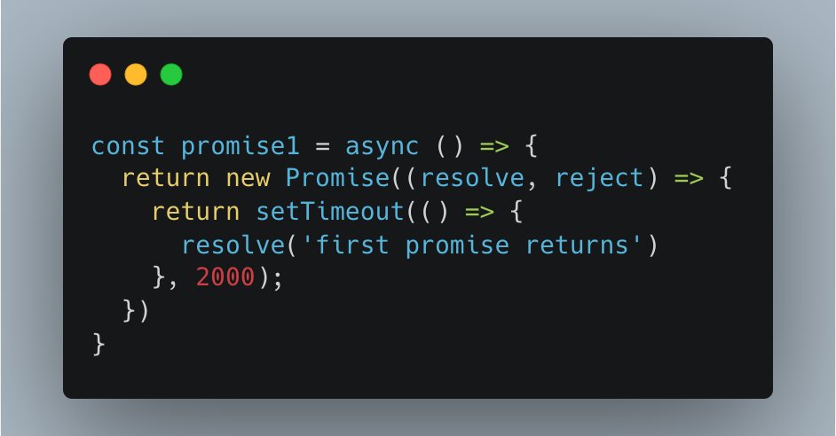
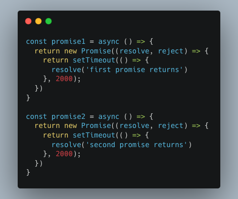
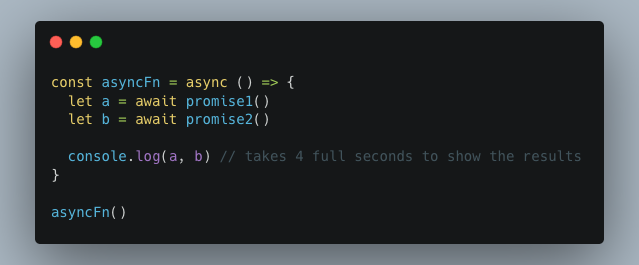
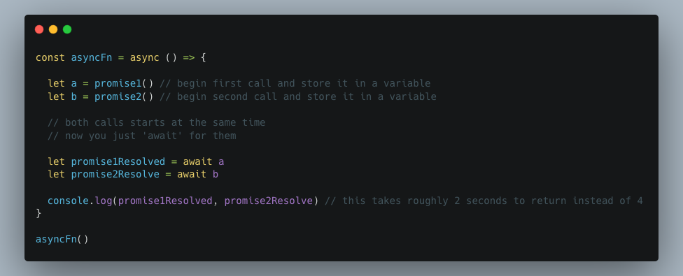

[Source Code](https://github.com/Nderim1/javascript/blob/main/promises.js)

 

...by using `Promise.all([])`.
But wait, there is another less known way!

Say you have 2 asynchronous functions that take 4 seconds to resolve (2 seconds each).

For testing purposes we can 'artificially' create these 2 functions by using `new Promise`
and making them return after 2 seconds by using `setTimeout(() => {...}, 2000)`.

So:

Now, usually if you use `async/await` (which you should :), you would do:

By doing that, `promise2` has to 'await' 2 full seconds before it starts to execute and resolve after 2 other seconds.

The whole operation lasts 4 unnecessary seconds.

How can you make both async functions start executing at the same time, or in other words make them run in parallel?

By calling them, before 'awaiting' them:

 

You can test this yourself.
Copy [the code](https://github.com/Nderim1/javascript/blob/main/promises.js) and paste it in your console.
